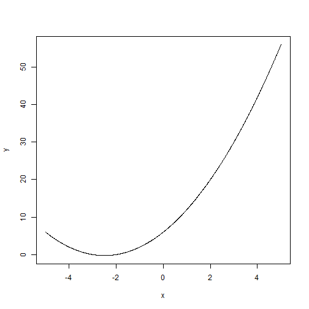

Quadratic Equation App
========================================================
author: Marco Antonio Andrade Barrera
date: Jun 21, 2015

What does the app makes?
========================================================

This application only does two things.

- Calculates the roots of a quadratic equation $a_0 + a_1X + a_2X^2$
- Makes a plot of the equation

How does the app do it?
========================================================
In R the *polyroot* function find the zeros of a real or complex polynomial. The app uses this function. Based on the coefficients entered by the user, it calcules the roots. The following chunk is an example of how it can do it, assuming $a_0=6$, $a_2=5$ and $a_2=1$

```r
polyroot(c(6,5,1))
```

```
[1] -2+0i -3-0i
```

The plot
========================================================
To make the plot, it uses the function *plot* as follows:

```r
x<-seq(-5,5,0.01)
y<-6+5*x+1*x^2
plot(x,y,type="n")
lines(x,y)
```

 

The plot
========================================================
If you want to see the source code and the app running, go to
* https://mandradebs.shinyapps.io/Project
* https://github.com/mandradebs/pitchDataProductos
